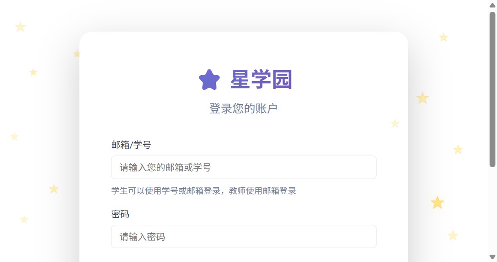
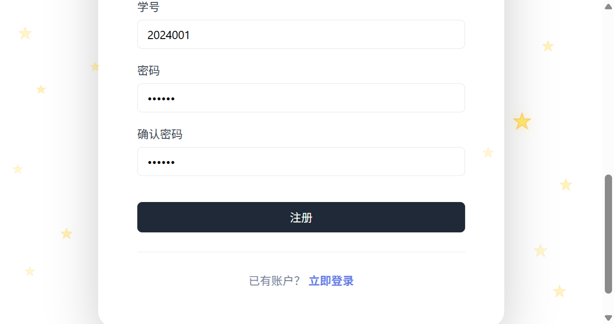

# ⭐ StarClass 星学园 - AI 原生智能教育平台

一款面向教师与学生的 AI 原生项目协作平台，通过多智能体系统实现个性化学习辅导、智能作业批改、创意写作辅助与代码辅导，让 AI 真正成为教学团队的一员。

---

## 📋 目录

- [项目简介](#项目简介)
- [核心功能](#核心功能)
- [宠物系统](#宠物系统)
- [游戏化学习](#游戏化学习)
- [AI 智能体系统](#ai-智能体系统)
- [多模型 LLM 配置](#多模型-llm-配置)
- [技术架构](#技术架构)
- [快速开始](#快速开始)
- [项目结构](#项目结构)
- [API 文档](#api-文档)
- [许可证](#许可证)

---

## 项目简介

StarClass 星学园是一款 **AI 原生** 的智能教育协作平台，通过多智能体系统革新传统教育方式。

### 核心价值

- 🤖 **多智能体协作**：智能助教、学习辅导、创意写作、代码辅导四大 AI 助手协同工作
- 🚀 **教学流程整合**：AI 批改作业、班级分析报告、作业辅导深度融入教师和学生工作流
- 🐾 **宠物养成系统**：3D 精细卡通宠物（星灵狐/星云猫/星辉龙/星辰鸟），完成作业喂养宠物，8级成长体系
- 🎮 **游戏化学习**：4款游戏与 AI 结合（AI出题/AI解说/AI提示/难度分级），完成作业解锁游戏
- 🌊 **流式响应**：SSE 实时渲染 AI 回复，类 ChatGPT 体验
- 🔀 **多模型支持**：支持 OpenAI / DeepSeek / 通义千问 / Ollama 本地模型，故障转移
- 🎨 **商用教育级 UI**：浅色专业风格 + 登录页 Three.js 金色 3D 星星点缀，星学园主题

### 目标用户

| 用户角色 | 使用场景 | 核心价值 |
|----------|----------|----------|
| 👨‍🏫 教师 | 作业批改、班级管理 | AI 一键批改，班级分析报告 |
| 👨‍🎓 学生 | 学习辅导、作业完成 | AI 作业辅导，个性化学习建议 |

---

## 核心功能

### 📱 教师工作台

- 创建与管理班级（生成班级码，学生扫码加入）
- 布置作业（支持截止日期、科目分类）
- **AI 一键批改**：自动评分 + 生成反馈，教师可在此基础上调整
- **AI 班级分析**：生成班级表现报告（提交率、平均分、教学建议）
- 查看学生能力六芒星图
- 班级实时聊天管理（禁言、全员禁言）

### 📱 学生工作台

- 查看与提交作业（文字/图片/文件）
- **AI 作业辅导**：按科目自动匹配智能体（编程→代码辅导，写作→创意写作）
- 作业批改结果与 AI 反馈查看
- 个人能力六芒星图与等级系统
- **AI 学习建议**：基于作业数据生成个性化学习计划
- **宠物养成**：3D 宠物互动喂养，作业完成自动奖励宠物经验
- **星星商城**：虚拟货币兑换主题/气泡/头像/宠物/宠物粮/盲盒
- **游戏中心**：4款 AI 增强游戏，完成作业后解锁

### 🤖 AI 智能体对话

- 4 大智能体，按角色提供专业服务
- **SSE 流式响应**：逐 token 实时渲染
- **上下文感知**：智能体感知用户作业、提交、班级、成绩数据
- **角色视角**：教师和学生看到不同回复
- LLM 状态指示灯：显示当前驱动模型（OpenAI/DeepSeek/规则引擎）

### 🎨 视觉效果

- 登录页 Three.js 金色 3D 立体星星（八面体金属质感 + 粒子尘埃 + 鼠标视差）
- 宠物页 Three.js 开源 GLB 3D 模型（4种宠物，加载后星空主题重新着色 + emissive 发光，含动画）
- 主应用浅色商用教育风格（白底卡片 + 专业蓝主色 + 琥珀强调色）
- 阿里巴巴矢量图标库（iconfont SVG Symbol 模式，50+ 矢量图标）
- 3 套主题切换（星空深蓝/樱花粉/暗夜黑），CSS 变量覆盖实时生效
- 商城头像框 emoji 预览 + 个人中心/AI聊天页头像框渲染
- 响应式设计

### 📸 页面截图

| 登录页 | 注册页 |
|--------|--------|
|  |  |

---

## 宠物系统

参考多邻国（连胜+虚拟货币+吉祥物情感催促）、学萌岛（12款萌宠+8级成长+积分喂养+徽章荣誉榜）、ClassDojo（行为加减分）设计。

### 核心循环

```
完成作业 → 获得10经验 → 宠物成长升级 → 喂养互动 → 激励更多学习（正向循环）
```

### 宠物种类（开源 GLB 模型 + 星空主题重新着色）

| 宠物 | 模型来源 | 许可证 | 主题色 | 价格 |
|------|----------|--------|--------|------|
| 🦊 星灵狐 | KhronosGroup glTF-Sample-Assets Fox | CC0/CC-BY 4.0 | 橙金发光 | 150 |
| 🐱 星云猫 | Quaternius Ultimate Monsters Cat | CC0 | 紫粉发光 | 150 |
| 🐉 星辉龙 | Quaternius Ultimate Monsters Dragon Evolved | CC0 | 蓝青发光 | 200 |
| 🐦 星辰鸟 | Three.js Flamingo | MIT | 黄粉发光 | 150 |

> 所有 GLB 模型加载后通过 `recolorGLBModel` 统一重新着色为星空主题色（MeshStandardMaterial + emissive 发光），让宠物呈现"星灵"质感，与深蓝星空背景协调。含 Survey/Walk/Run/Idle 等动画，GLB 加载失败时回退到程序化卡通建模（MeshToonMaterial + 描边）。

### 成长体系

| 等级 | 升级所需经验 | 状态 |
|------|-------------|------|
| Lv.1 → 2 | 40 | 蛋/幼体 |
| Lv.2 → 3 | 80 | 成长期 |
| Lv.3 → 4 | 140 | 成长期 |
| Lv.4 → 5 | 220 | 成长期 |
| Lv.5 → 6 | 320 | 成长期 |
| Lv.6 → 7 | 440 | 成长期 |
| Lv.7 → 8 | 580 | 接近满级 |
| Lv.8 | — | 满级 |

### 互动机制

| 操作 | 效果 |
|------|------|
| 喂普通粮 | 饱腹度 +10，经验 +5 |
| 喂高级粮 | 饱腹度 +30，经验 +15 |
| 抚摸（点击3D宠物） | 心情值 +10，经验 +2 |
| 完成作业 | 经验 +10，饱腹度 +5（自动奖励） |
| 状态衰减 | 每6小时饱腹度 -5、心情值 -3 |

### 心理学机制

- **损失厌恶**：宠物会饿（饱腹度衰减），驱动学生持续完成作业
- **成长反馈**：等级可视化，经验进度条实时更新
- **情感联结**：宠物互动撒娇动画，满级解锁专属成就感

---

## 游戏化学习

4款经典游戏与 AI 深度结合，完成作业后解锁游戏。

| 游戏 | AI 增强 | 说明 |
|------|---------|------|
| 🃏 记忆翻牌 | AI 出题 | 调用智能体生成学习词语配对，失败降级默认词库 |
| 🐍 贪吃蛇 | AI 解说 | 每30分AI生成鼓励语，浅色卡片面板展示 |
| 🔢 2048 | AI 提示 | AI提示按钮（5秒防刷），浮层显示推荐方向 |
| ⭕ 井字棋 | 难度分级 | 简单(随机)/普通/困难(minimax算法不败) |

> 所有 AI 调用失败时静默降级，不影响游戏核心体验。

---

## AI 智能体系统

### 智能体架构

```
┌─────────────────────────────────────────────────────┐
│                   Agent Orchestrator                │
│            (上下文感知 + 多模型 + 故障转移)            │
└───────────────────────┬─────────────────────────────┘
                        │
        ┌───────────────┼───────────────┐
        ↓               ↓               ↓
┌─────────────┐  ┌─────────────┐  ┌─────────────┐
│  Teaching   │  │   Study     │  │  Creative   │
│  Assistant  │  │    Coach    │  │   Writer    │
│  (智能助教)  │  │  (学习辅导)  │  │  (创意写作)  │
└──────┬──────┘  └──────┬──────┘  └──────┬──────┘
       │                │                │
       └────────────┬───┴────────────────┘
                    ↓
┌─────────────────────────────────────────┐
│           Code Coach (代码辅导)           │
└─────────────────────────────────────────┘
```

### 内置智能体

| 智能体 | 类型 | 核心能力 | 整合场景 |
|--------|------|----------|----------|
| 📝 智能助教 | `teaching_assistant` | 作业批改、反馈生成、班级分析 | 教师批改页面 AI 批改按钮 |
| 🎓 学习辅导 | `study_coach` | 学习计划、薄弱点分析、方法推荐 | 学生仪表盘 AI 建议 + 作业辅导 |
| ✍️ 创意写作 | `creative_writer` | 作文构思、故事创作、润色修改 | 写作类作业自动匹配 |
| 💻 代码辅导 | `code_coach` | 代码分析、错误诊断、优化建议 | 编程类作业自动匹配 |

### 智能体工作流程

```text
用户提问 → Agent Orchestrator
               │
               ├─ 1. 构建用户上下文（作业/提交/班级/成绩）
               │
               ├─ 2. 尝试 LLM 调用（多模型故障转移）
               │     ├─ 主模型（如 DeepSeek）
               │     ├─ 备用模型1（如 通义千问）
               │     └─ 备用模型2（如 Ollama 本地）
               │
               ├─ 3. LLM 不可用时 → 规则引擎回退
               │     └─ 基于关键词 + 用户上下文生成回复
               │
               └─ 4. SSE 流式返回（逐 token）
```

### 教学流程整合

| 整合点 | API 端点 | 说明 |
|--------|----------|------|
| AI 批改作业 | `POST /api/submissions/{id}/ai-grade` | 基于内容长度、科目关键词生成评分和反馈 |
| AI 班级分析 | `POST /api/agents/analyze-class` | 生成班级报告（提交率、平均分、教学建议） |
| AI 作业辅导 | `POST /api/agents/homework-help` | 按科目自动匹配智能体，带作业上下文 |
| AI 学习建议 | `POST /api/agents/{id}/chat` | 学生仪表盘，基于作业数据生成学习计划 |
| SSE 流式对话 | `POST /api/agents/{id}/stream-chat` | 逐 token 流式返回 |

---

## 多模型 LLM 配置

参考 AutoGen 多模型故障转移、Dify 插件化模型提供商、Open Deep Research 任务专属模型设计。

### 支持的模型提供商

| 提供商 | 配置名 | 模型示例 | 说明 |
|--------|--------|----------|------|
| OpenAI | `openai` | gpt-4o-mini, gpt-4o | 官方 API |
| DeepSeek | `deepseek` | deepseek-chat, deepseek-reasoner | 国内可用，性价比高 |
| 通义千问 | `qwen` | qwen-plus, qwen-max | 阿里云，兼容 OpenAI 格式 |
| Ollama | `ollama` | llama3, qwen2 | 本地部署，无需 API Key |

### 配置方式

编辑 `backend/.env` 文件：

```bash
# 方式1：统一配置（推荐单提供商）
LLM_PROVIDER=deepseek
LLM_API_KEY=sk-your-deepseek-key
LLM_MODEL=deepseek-chat

# 方式2：提供商专属配置
DEEPSEEK_API_KEY=sk-your-deepseek-key
DEEPSEEK_MODEL=deepseek-chat

# 故障转移（主提供商失败后依次尝试）
LLM_FALLBACK_PROVIDERS=qwen,ollama
QWEN_API_KEY=sk-your-qwen-key
OLLAMA_BASE_URL=http://localhost:11434/v1
```

### 故障转移机制

```
用户请求 → 主模型(DeepSeek) → 成功 → 返回
                ↓ 失败
          备用1(通义千问) → 成功 → 返回
                ↓ 失败
          备用2(Ollama) → 成功 → 返回
                ↓ 全部失败
          规则引擎回退 → 基于上下文生成回复
```

### 每 Agent 独立模型

参考 Open Deep Research 任务专属模型设计，不同智能体可配置不同模型：

```python
# orchestrator.py
AGENT_PREFERRED_PROVIDER = {
    "teaching_assistant": None,    # 使用默认（需强推理）
    "study_coach": None,           # 使用默认
    "creative_writer": None,       # 使用默认
    "code_coach": None,            # 使用默认
}
```

### LLM 状态查询

```
GET /api/agents/llm/status
```

返回当前可用提供商和主模型，前端显示状态指示灯。

---

## 技术架构

### 技术栈

#### 后端（Python/FastAPI）

| 技术 | 用途 |
|------|------|
| Python 3.11+ | 开发语言 |
| FastAPI | Web 框架 |
| SQLAlchemy 2.0+ | ORM |
| SQLite | 数据库（轻量，无需额外安装） |
| OpenAI SDK | LLM 调用（兼容 DeepSeek/Qwen/Ollama） |
| JWT | 认证 |
| SSE (Server-Sent Events) | 流式响应 |

#### 前端

| 技术 | 用途 |
|------|------|
| React 18+ | UI 框架 |
| TypeScript 5.3+ | 类型安全 |
| Vite 5.0+ | 构建工具 |
| Three.js | 3D 星空背景 + 3D 宠物精细建模 |
| Fetch API + SSE | 流式对话渲染 |

### 架构设计

```
┌──────────────────────────────────────────────────────────┐
│                    Frontend (React + Vite)                │
│      Three.js 3D 星星 · SSE 流式渲染 · 浅色商用 UI         │
└────────────────────────┬─────────────────────────────────┘
                         │ /api/* (Vite Proxy 代理)
                         ↓
┌──────────────────────────────────────────────────────────┐
│                  Backend (FastAPI)                        │
│                                                          │
│  ┌────────┐ ┌────────┐ ┌──────────┐ ┌────────┐ ┌──────┐│
│  │ Auth   │ │ Classes│ │ Homeworks│ │Submits │ │Chat  ││
│  └────┬───┘ └────┬───┘ └────┬─────┘ └────┬───┘ └──┬───┘│
│       └──────────┴──────────┴────────────┴────────┘     │
│                    ┌─────────────┐                       │
│                    │   Agents    │                       │
│                    │ Orchestrator│                       │
│                    └──────┬──────┘                       │
│                           │                              │
│         ┌─────────────────┼─────────────────┐            │
│         ↓                 ↓                 ↓            │
│   ┌──────────┐     ┌───────────┐     ┌───────────┐      │
│   │   LLM    │     │  Context  │     │  Rule     │      │
│   │ Factory  │     │  Builder  │     │  Engine   │      │
│   │(多模型)   │     │(作业/班级) │     │(回退)     │      │
│   └────┬─────┘     └───────────┘     └───────────┘      │
│        │                                                 │
│   ┌────┴────────────────────────────┐                    │
│   ↓        ↓        ↓        ↓       │                   │
│ OpenAI  DeepSeek  Qwen    Ollama     │                   │
│ └───────────────────────────────────┘                    │
└──────────────────────────────────────────────────────────┘
                         │
                    ┌────┴────┐
                    ↓         ↓
              ┌──────────┐ ┌────────┐
              │  SQLite  │ │Uploads │
              │ (数据库)  │ │(文件)   │
              └──────────┘ └────────┘
```

---

## 快速开始

### 环境要求

- Python 3.11+
- Node.js 18+
- Git

### 1. 克隆项目

```bash
git clone https://github.com/yanxiao07/StarClass.git
cd StarClass
```

### 2. 配置后端

```bash
cd backend

# 创建虚拟环境
python -m venv venv

# 激活虚拟环境
# Windows
venv\Scripts\activate
# macOS/Linux
source venv/bin/activate

# 安装依赖
pip install -r requirements.txt

# 配置环境变量
cp .env .env  # 或直接编辑 backend/.env
```

编辑 `backend/.env`，配置 LLM（可选，不配置则使用规则引擎）：

```bash
# 使用 DeepSeek（推荐，国内可用）
LLM_PROVIDER=deepseek
DEEPSEEK_API_KEY=sk-your-key
DEEPSEEK_MODEL=deepseek-chat

# 或使用通义千问
LLM_PROVIDER=qwen
QWEN_API_KEY=sk-your-key

# 或使用 Ollama 本地部署（无需 API Key）
LLM_PROVIDER=ollama
OLLAMA_BASE_URL=http://localhost:11434/v1
OLLAMA_MODEL=llama3
```

### 3. 初始化数据库

```bash
# Windows
set PYTHONPATH=.
python -m app.utils.init_db
python -m app.utils.seed_data

# macOS/Linux
PYTHONPATH=. python -m app.utils.init_db
PYTHONPATH=. python -m app.utils.seed_data
```

### 4. 启动后端

```bash
# Windows
set PYTHONPATH=.
python -m uvicorn app.main:app --host 0.0.0.0 --port 8001

# macOS/Linux
PYTHONPATH=. uvicorn app.main:app --host 0.0.0.0 --port 8001
```

后端服务运行在 `http://localhost:8001`

### 5. 配置并启动前端

```bash
# 回到项目根目录
cd ..

# 安装前端依赖
npm install

# 启动前端
npm run dev
```

前端服务运行在 `http://localhost:3000`（Vite 代理 /api 到后端）

### 6. 访问应用

打开浏览器访问 `http://localhost:3000`

> **注意**：前端通过 Vite 代理转发 API 请求到后端，无需关心跨域问题。

---

## 项目结构

```
StarClass/
├── backend/                          # Python/FastAPI 后端
│   ├── app/
│   │   ├── core/
│   │   │   ├── config.py             # 环境配置（多模型 LLM 配置）
│   │   │   ├── database.py           # SQLite 数据库连接（含自动迁移）
│   │   │   └── security.py           # JWT 认证
│   │   ├── models/                   # SQLAlchemy 模型
│   │   │   ├── user.py               # 用户模型（含 theme/chat_bubble_style/avatar）
│   │   │   ├── class_.py             # 班级模型
│   │   │   ├── homework.py           # 作业模型
│   │   │   ├── submission.py         # 提交模型
│   │   │   ├── agent.py              # 智能体模型
│   │   │   └── pet.py                # 宠物模型（Pet/UserPet/Purchase）
│   │   ├── routers/                  # API 路由
│   │   │   ├── auth.py               # 认证
│   │   │   ├── classes.py            # 班级管理
│   │   │   ├── homeworks.py          # 作业管理
│   │   │   ├── submissions.py        # 提交管理（含 AI 批改）
│   │   │   ├── agents.py             # 智能体（含 SSE 流式）
│   │   │   ├── chat.py               # 班级聊天
│   │   │   ├── store.py              # 星星商城（持久化+盲盒+宠物商品）
│   │   │   └── pets.py               # 宠物系统（喂养/互动/成长）
│   │   ├── agents/                   # AI 智能体核心
│   │   │   ├── llm_factory.py        # 多模型 LLM 工厂（故障转移）
│   │   │   ├── orchestrator.py       # 智能体编排器（上下文感知）
│   │   │   ├── base.py               # 智能体基类
│   │   │   └── registry.py           # 智能体注册中心
│   │   ├── schemas/                  # Pydantic 模式
│   │   ├── utils/                    # 工具函数
│   │   └── main.py                   # FastAPI 入口
│   ├── .env                          # 环境变量配置
│   └── requirements.txt
├── src/                              # React 前端
│   ├── components/
│   │   ├── Icon.tsx                  # iconfont 矢量图标组件（50+ 图标）
│   │   └── three/
│   │       ├── ThreeDBackground.tsx  # Three.js 3D 星空背景（登录页）
│   │       └── Pet3D.tsx             # Three.js 3D 宠物（GLB加载+星空重新着色+程序化回退）
│   ├── features/
│   │   ├── auth/                     # 认证（登录/注册/个人中心含头像框）
│   │   ├── class/                    # 班级（列表/聊天）
│   │   ├── dashboard/                # 仪表盘（含 AI 分析/建议）
│   │   ├── homework/                 # 作业（含 AI 批改/辅导/宠物奖励）
│   │   ├── agents/                   # 智能体对话（SSE 流式）
│   │   ├── pet/                      # 宠物主页（3D展示+互动+喂养+成长）
│   │   ├── store/                    # 星星商城（主题/气泡/头像/宠物/盲盒）
│   │   ├── settings/                 # LLM 配置（教师专属）
│   │   └── games/                    # 游戏模块（AI 增强 + 星星解锁）
│   ├── services/                     # API 服务层
│   ├── styles/                       # 全局样式（CSS 变量 + 3 主题）
│   ├── App.tsx                       # 应用入口
│   └── main.tsx
├── public/
│   └── models/                       # 开源 GLB 3D 模型文件
│       ├── Fox.glb                   # KhronosGroup Fox (CC0)
│       ├── Cat.glb                   # Quaternius Cat (CC0)
│       ├── Dragon.glb                # Quaternius Dragon (CC0)
│       └── Flamingo.glb              # Three.js Flamingo (MIT)
├── docs/
│   └── screenshots/                  # 页面截图
├── .env                              # 前端环境变量
├── vite.config.ts                    # Vite 配置（含 /api 代理）
├── package.json
└── README.md
```

---

## API 文档

### 智能体 API

| 端点 | 方法 | 说明 |
|------|------|------|
| `/api/agents` | GET | 获取智能体列表 |
| `/api/agents/{id}/chat` | POST | 与智能体对话（非流式） |
| `/api/agents/{id}/stream-chat` | POST | SSE 流式对话 |
| `/api/agents/{id}/conversations` | GET | 获取会话列表 |
| `/api/agents/{id}/conversations/{conv_id}` | GET | 获取会话消息 |
| `/api/agents/analyze-class` | POST | AI 班级分析报告 |
| `/api/agents/homework-help` | POST | AI 作业辅导（按科目匹配） |
| `/api/agents/llm/status` | GET | LLM 配置状态 |

### 其他 API

| 模块 | 端点 |
|------|------|
| 认证 | `/api/auth/login`, `/api/auth/register`, `/api/users/me` |
| 班级 | `/api/classes`, `/api/classes/teacher`, `/api/classes/join` |
| 作业 | `/api/homeworks` (CRUD) |
| 提交 | `/api/submissions`, `/api/submissions/{id}/ai-grade` |
| 聊天 | `/api/chat/class/{class_id}` |
| 商城 | `/api/store/items`, `/api/store/items/{id}/purchase`, `/api/store/items/{id}/use` |
| 宠物 | `/api/pets/my`, `/api/pets/active`, `/api/pets/{id}/feed`, `/api/pets/{id}/interact`, `/api/pets/{id}/activate`, `/api/pets/{id}/rename`, `/api/pets/reward/homework` |

### 交互式 API 文档

启动后端后访问 `http://localhost:8001/docs` 查看 Swagger UI。

---

## 许可证

MIT License

---

**⭐ StarClass - AI 让学习更智能 ⭐**
